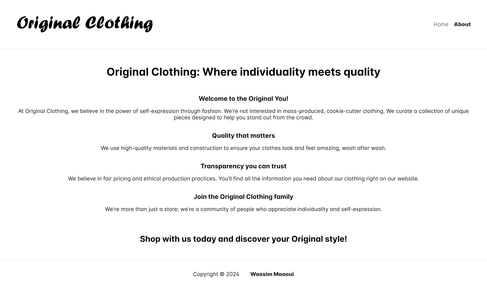
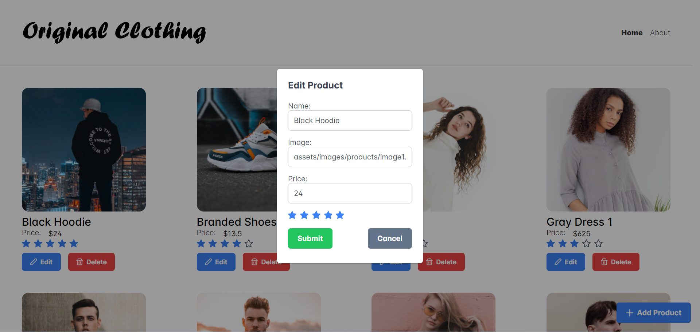

# Original Clothing

Original Clothing is a virtual clothing store built with Angular, designed to provide a hands-on learning experience for front-end development.

It offers a curated selection of clothing items that you can interact with.

## Table of contents

- [Original Clothing](#original-clothing)
  - [Table of contents](#table-of-contents)
  - [Overview](#overview)
    - [Functionalities](#functionalities)
    - [Screenshots](#screenshots)
  - [My process](#my-process)
    - [Built with](#built-with)
  - [Author](#author)

## Overview

### Functionalities

Users should be able to:

- Browse through a selection of clothing items, including their names, prices, and ratings.
- Create new clothing items with details like name, price, and rating.
- Modify existing clothing items by changing their details.
- Remove unwanted clothing items from the store.
- Manage Dialogs
- Navigate between Home and About Us pages.

### Screenshots

BASIC SCREENS:

|  |  |
| :-----------------------------------------------------: | :-----------------------------------------------------: |

ADD CLOTHING ITEM:

|  |
| :-----------------------------------------------------: |

EDIT CLOTHING ITEM:

|  |
| :-----------------------------------------------------: |

DELETE CLOTHING ITEM:

|  |
| :-----------------------------------------------------: |

## My process

### Built with

- Front-End: Angular ([https://angular.io/])
- Back-End: Express.js ([https://expressjs.com/])

## Author

- Frontend Mentor - [@wess-MHHW](https://www.frontendmentor.io/profile/wess-MHHW)
- LeetCode - [@wess-MHHW](https://leetcode.com/wess-MHHW/)
- Linkedin - [@wassim-maaoui](https://www.linkedin.com/in/wassim-maaoui/)
